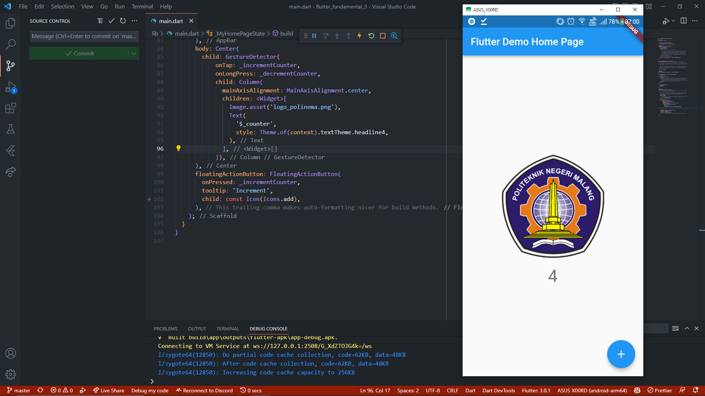
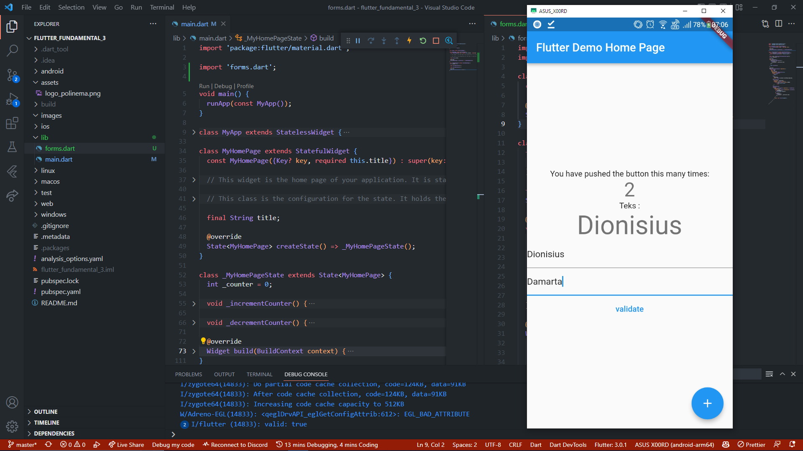

# flutter_fundamental_3

Praktukum Modul 16 TSA Mobile Flutter Program

# Praktikum1

Pada praktikum ini ketika kita menekan logo Polinema maka value dari variable counter akan bertambah 1, Sementara jika kita menekan tahan pada logo maka value dari variable counter akan berkurang 1.

# Praktikum2

Pada praktikum ini ketika mengisikan value pada widget TextFormField yang pertama maka value tersebut akan langsung ditampilkan pada widget text di atasnya, hal ini dapat dilakukan karena pada TextEditingController ditambahkan event listener yang bertugas mengupdate value pada TextEditingController setiap kali value tersebut berubah.

# Praktikum3

Pada praktikum ini TextField yang disediakan hanya bisa menerima inputan berupa angka, hal ini dapat dilakukan karena ditambahkan widget FormFieldValidator yang bertugas mengvalidasi inputan yang diinputkan oleh user.

## Getting Started

This project is a starting point for a Flutter application.

A few resources to get you started if this is your first Flutter project:

- [Lab: Write your first Flutter app](https://docs.flutter.dev/get-started/codelab)
- [Cookbook: Useful Flutter samples](https://docs.flutter.dev/cookbook)

For help getting started with Flutter development, view the
[online documentation](https://docs.flutter.dev/), which offers tutorials,
samples, guidance on mobile development, and a full API reference.
